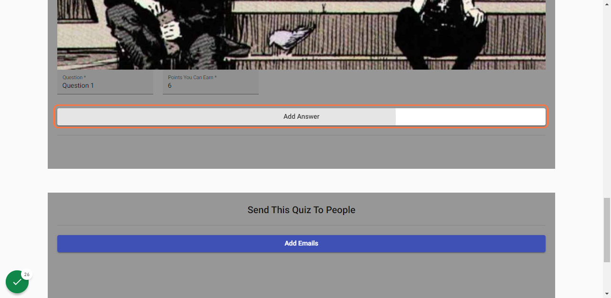

# Quiz-App

Quiz App Created With Mean Stack. When user creates profile, he/she is able to create new quiz and challenge other people by sending it to their emails. people's results are stored in the database and author of the quiz is able to see their results.

# Application Guide

**1.** Go to My [Quiz app](https://quiz-b385b.web.app/register) Registration Page
 

**2.** Enter register information and click register. Verification link will be sent on the email

 
**3.** Click on the link to verify
 

 
**4.** Enter Login information and click Log In

 
**5.** Click on Add Quiz

 
**6.** Enter quiz information and start creating questions and answers by clicking "Add Question" button. You can create as may questions and answers you want!

 
**7.** Add question information and then start creating answers by clicking "Add Answer" button. I'll create 2 answers for this guide.

 
**8.** Check Correct Checkbox if that answer is correct

 
**9.** Add people's emails to challenge them. Quiz's link will be sent to them via email

 
**10.** When finished click on Upload Quiz

 
**11.** Hover over the quiz you want to take and click "Take Quiz" button

 
**12.** Select answers, when you finish quiz you will see your results. You can click "Go Back To Home Page" button to go back to your profile

 
**13.** Click on See Results to see other people's results

 
